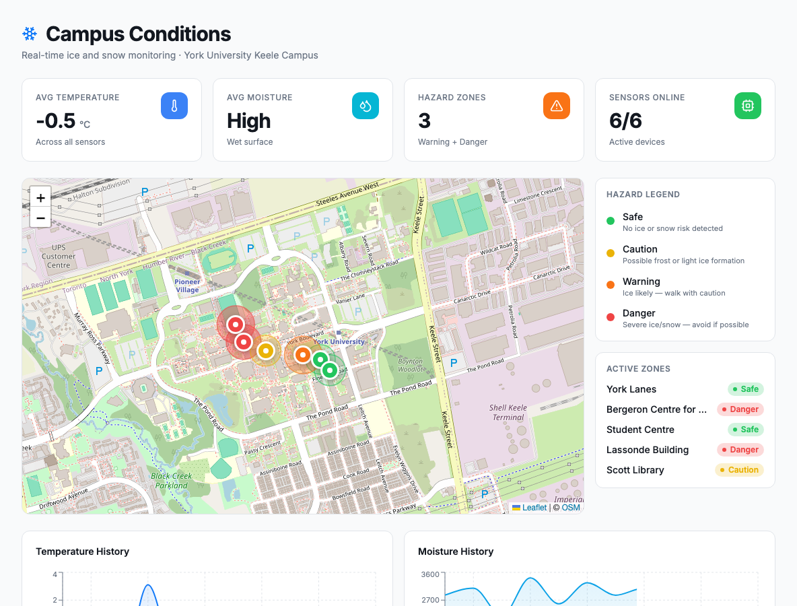
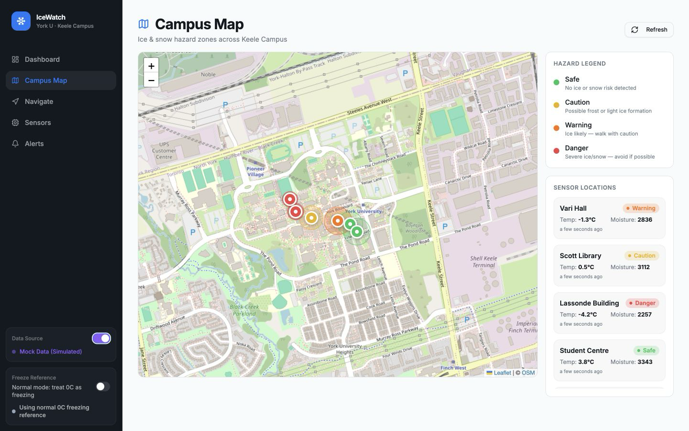
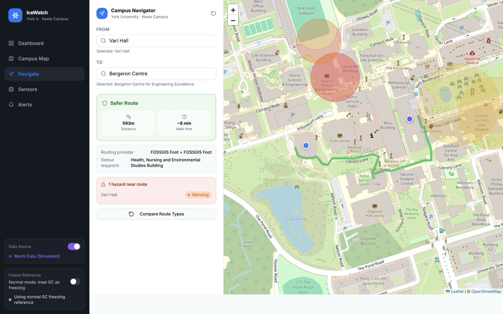
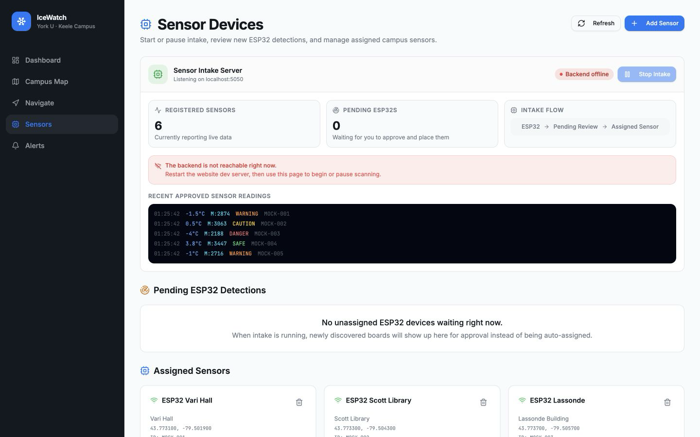
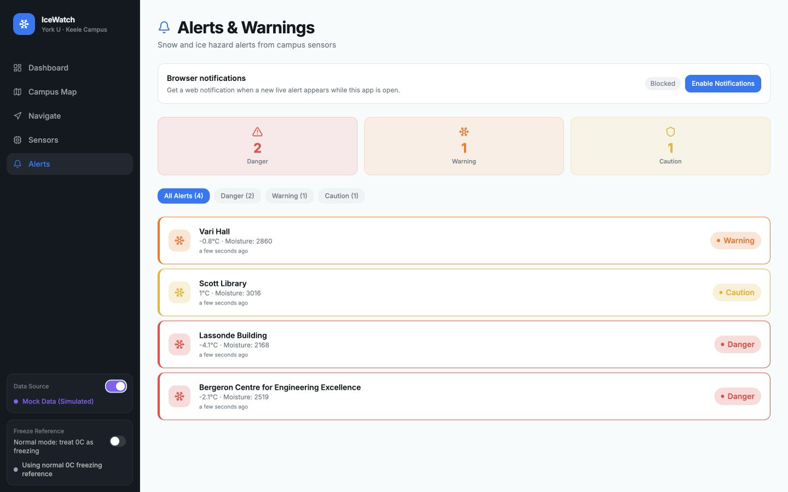
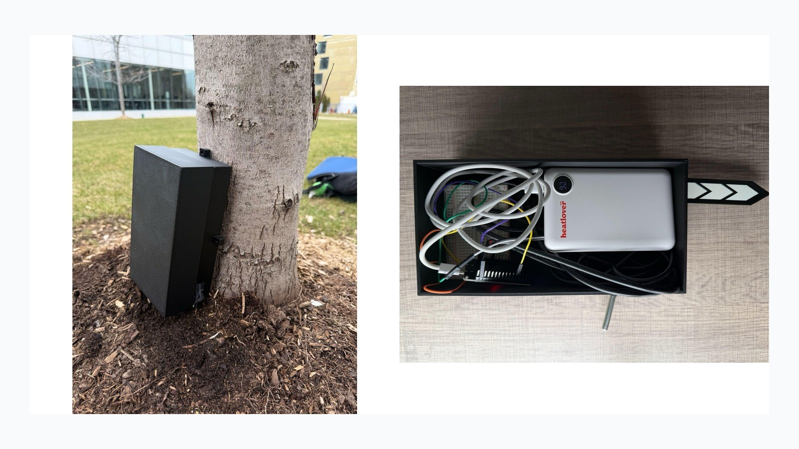

# IceWatch


IceWatch is an early-stage winter safety prototype that combines ESP32 sensing
nodes with a live campus map, alerts, route comparison, and a local sensor admin
workflow.

The goal is simple: make hidden ice and slush visible before someone finds it
the hard way. The current build focuses on York University's Keele campus, but
the app is structured around reusable sensor nodes and replaceable site data.

<p align="center">
  
</p>

## Screenshots

| Campus map | Safer route |
| --- | --- |
|  |  |

| Sensor admin | Alerts |
| --- | --- |
|  |  |

## At a Glance

| Area | What it does |
| --- | --- |
| Hazard map | Displays localized walkway risk using safe, caution, warning, and danger states |
| Route comparison | Lets users compare direct and safer campus routes |
| Alerts | Surfaces warning and danger conditions in one place |
| Sensor admin | Handles ESP32 intake, review, location setup, and sensor radii |
| Demo mode | Provides realistic sample readings for review without hardware connected |
| Tests | Covers hazard logic, sensor middleware, location search, and device helpers |

## Hardware

<p align="center">
  
</p>

The hardware build uses an ESP32, a DS18B20 temperature sensor, a SEN0308
capacitive moisture sensor, portable power, and a 3D-printed enclosure. The
public repository documents the system interface and validation path. Detailed
firmware, calibration, field data, CAD files, and deployment procedures are not
included in this public release.

## Validation

This is an early-stage prototype. Current validation includes controlled and
outdoor sensor tests. Future work includes larger winter trials, enclosure
durability testing, battery optimization, and facilities-user feedback.

| Area | Result |
| --- | --- |
| Controlled sensor validation | 8/9 expected outcomes; all trials produced distinguishable readings |
| Outdoor node testing | 10/10 outdoor trials returned consistent temperature/moisture data |
| Interface validation | Testers identified hazards reliably; route guidance still needs refinement |

## Project Structure

```text
.
|-- Ice_Website/             React/Vite app and local sensor API
|-- docs/                    Concise research, hardware, validation, and testing notes
|-- docs/assets/             Screenshots and hardware photos for GitHub rendering
|-- firmware/                Public sensor data contract
|-- .github/workflows/       CI verification
```

## Running Locally

```bash
cd Ice_Website
npm ci
npm run dev
```

Open [http://localhost:5173](http://localhost:5173).

Demo flow:

1. Toggle `Mock Data`.
2. Open `Campus Map`.
3. Compare routes in `Navigate`.
4. Open `Sensors` with `admin / admin`.

## Testing

```bash
cd Ice_Website
npm run check
```

The check command runs linting, typecheck, unit/middleware tests, production
build, and dependency audit.

## Repository Scope

This repository is a portfolio-oriented public release. It includes the working
web prototype, selected screenshots, validation notes, and enough hardware
context to understand the system. It intentionally excludes raw experimental
logs, detailed calibration procedures, enclosure source files, full firmware
implementation, and deployment-specific materials.

## License and Use

This project is source-available for portfolio review only. All rights are
reserved. The code, images, text, hardware materials, and project design may not
be copied, redistributed, republished, sold, sublicensed, or incorporated into
another product without written permission.

See [LICENSE](LICENSE) for the full terms.

## Credits

Built and maintained by Rehan Jetha.

Artem Aleksandryuk contributed early problem research, interviews, ideation
input, presentation formatting, enclosure development, and 3D printing.
Kyrillos Yousry contributed early problem research, an interview, concept
sketches, risk-scoring input, and housing CAD input. Pirajeet Ahilashen
contributed interview-question and survey setup, an interview, feasible-concept
development, and early UI layout ideas.
