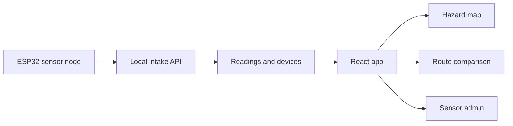

# Architecture

IceWatch collects local winter-condition readings, classifies hazard risk, and displays that risk through a map, alerts, routing, and sensor administration.

## App Surfaces

| Area | Purpose |
| --- | --- |
| Dashboard | Summary stats, map preview, and recent trends |
| Campus Map | Hazard zones and sensor cards |
| Navigate | Safer/direct route comparison |
| Sensors | Hardware intake and device setup |
| Alerts | Active warning and danger conditions |

The current implementation is intentionally local-first. Persistent storage, authentication, and facilities workflows are part of the next engineering pass.
