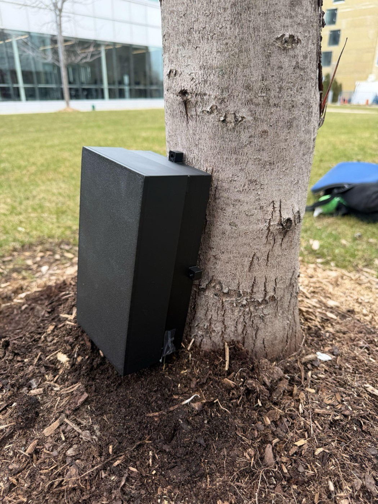
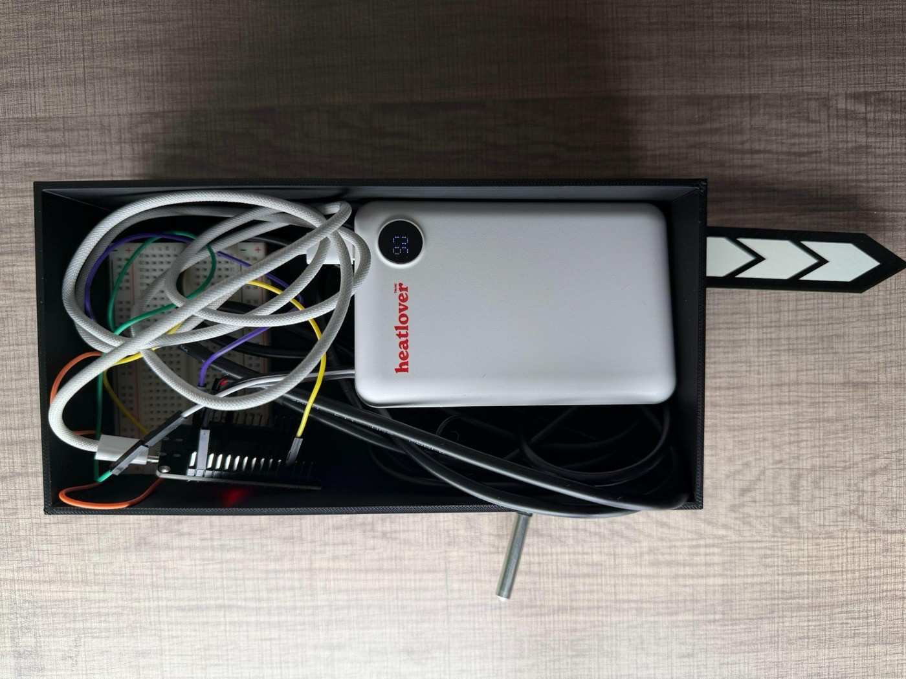
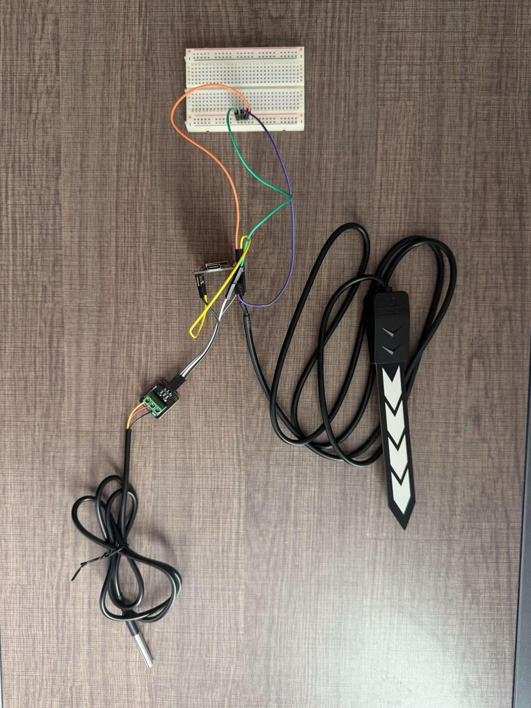

# Hardware

IceWatch uses a compact sensing node to collect temperature and surface-moisture signals near walkway level. The public hardware documentation is intentionally concise: enough to show the engineering direction, not a full deployment playbook.

## Build Photos

| Field enclosure | Internal node build | Sensor wiring |
| --- | --- | --- |
|  |  |  |

## Node Stack

| Component | Role |
| --- | --- |
| ESP-WROOM-32 / ESP32 | WiFi-enabled controller |
| DS18B20 temperature sensor | Local temperature signal |
| SEN0308 capacitive moisture sensor | Surface moisture signal |
| Portable power bank | Untethered field testing |
| 3D-printed enclosure | Electronics protection and repeatable placement |

## Public Interface

Sensor nodes send temperature and moisture readings to the local intake service. New devices are held for approval before they appear on the public map.

```json
{
  "device_id": "ESP-VH-001",
  "temperature": -1.4,
  "moisture": 2700,
  "ice_level": 2
}
```

The exact firmware, enclosure tolerances, and calibration process are still evolving and are intentionally kept high-level in this public repo.

## Current Hardware Limits

- Ice risk is inferred from temperature and moisture; it is not a direct ice sensor.
- Sensor contact, drainage, sun exposure, and wind can affect readings.
- The enclosure needs longer durability testing before real winter deployment.
- Battery life and sensor mounting still need optimization.
